<picture>
  <source media="(prefers-color-scheme: dark)" srcset="assets/banner-dark.svg">
  <source media="(prefers-color-scheme: light)" srcset="assets/banner-light.svg">
  
</picture>

  

<!-- Once the portfolio is live on Vercel, uncomment this and put the real URL
     in the href. A badge pointing at a dead link is worse than one badge fewer,
     which is why it ships commented out rather than pointing at a guess.

-->

---

## Hello 

I'm a software engineer working across the full **.NET** stack — C#, ASP.NET Core,
Entity Framework Core and SQL Server on the back end, Angular and TypeScript on
the front.

What actually interests me is the seam where those systems meet machine learning:
forecasting engines, LLM orchestration, and models that have to survive contact
with real users rather than stay in a notebook.

I hold **two BSc degrees in Computer Systems Engineering** — University of
Greenwich and MSA University — and completed the **ITI intensive .NET Track**.

---

## What I'm building

> ### FinSight — an AI virtual CFO for small businesses
>
> Most small companies have no financial analyst, so the software has to do the
> analyst's job: notice the problem, quantify it, and say what to do about it.
> FinSight ingests a company's transactions, forecasts 90 days of cash flow,
> detects risk before it becomes a crisis, and explains what it found in plain
> language.

| Source files | Commits | Engineers | DB tables |
|:---:|:---:|:---:|:---:|
| **464** | **115** | **6** | **30** |

**What that involved**

- 17 controllers with command/query-separated DTOs, a generic repository over
  Unit of Work, and multi-tenancy through a scoped tenant service
- JWT bearer auth with an HTTP-only cookie fallback, full issuer/audience/lifetime
  validation, and role-based authorisation over ASP.NET Identity
- **Nixtla TimeGPT** for time-series cash-flow forecasting and **LangFlow**
  for the recommendation and chat layer, orchestrated through LangFlow
- Real-time alerting on **SignalR**, with **Hangfire** running scheduled forecast
  jobs behind an admin-only dashboard
- A 30-table SQL Server schema with code-first migrations and a daily aggregation
  layer for the hot query path
- Health-check endpoints, a global exception handler, environment-aware config,
  and both unit and integration test projects

`C#` · `ASP.NET Core` · `EF Core` · `SQL Server` · `Angular 17` · `SignalR` · `Hangfire` · `TimeGPT` · `LangFlow`

[**→ Source**](https://github.com/gamaleldin11/FinSight_G)

---

## Selected work

<b>Speech Emotion Recognition</b> — transformer-based emotion classification from raw audio &nbsp;·&nbsp; <code>93% accuracy</code>

 

My **graduation project**, graded **4.0 / Excellent**. It classifies emotion from
the acoustic properties of speech rather than from what is said, so it never needs
a transcript.

- Fine-tuned a pretrained **HuBERT** encoder from Hugging Face — linear projection
  to 256 dimensions, dropout regularisation, classification head over the pooled
  temporal representation
- Made the encoder swappable: moving to Wav2Vec2 is a single config change, since
  models load through the `AutoModel` abstraction
- Trained on the **ShEMO** corpus (~3,000 semi-natural utterances, 3h25m of speech)
  with augmentation to counter significant class imbalance
- Shipped as a working desktop application — login, patient records, live
  microphone capture, SQLite persistence — not a notebook
- **93% accuracy**, validated with a confusion matrix across the emotion classes

`Python` · `PyTorch` · `HuBERT` · `Hugging Face` · `SQLite`

<b>Fractional Investment Platform</b> — Angular SPA for fractional ownership of high-value assets

 

Breaks property, gold and equities into affordable fractional shares, so a user
can build a diversified position without the capital a whole unit would need.
Covers the full journey from landing page to funded, tracked holdings. Built with
a team of five.

- 17 components and 11 routed pages — dashboard, listings, asset detail, checkout,
  deposit funds, authentication
- Route guards for admin access and user-existence checks, plus six injectable
  services covering auth, API access, payments, notifications and projects
- PayPal checkout flow and a built-in chatbot assistant with typing indicators
  and message threading

`Angular` · `TypeScript` · `RxJS` · `Angular Material`

<b>Enterprise MVC & Identity Suite</b> — ASP.NET Core MVC with full authentication workflows

 

A pair of applications built to work through the parts of enterprise .NET that
matter in production.

- Full CRUD over a student/department domain via a repository abstraction with
  interfaces, rather than `DbContext` straight from controllers
- Schema evolution through EF Core code-first migrations, including an auth
  migration layered onto an existing schema
- Registration and login on ASP.NET Identity with view models and server-side
  validation, plus a second application demonstrating external OAuth login

`C#` · `ASP.NET Core MVC` · `EF Core` · `ASP.NET Identity` · `Razor`

<b>FinSight Presentation Engine</b> — an animated slide deck as a web application

 

Rather than exporting slides, I built the presentation as an application:
full-screen animated transitions, keyboard-driven navigation, and a live editor
so content can be corrected mid-presentation without leaving the deck.

Arrows and space to navigate, `E` to edit in place, `R` to replay animations,
`F` for fullscreen. Slide definitions are separated from editable content, so
copy changes never touch layout code.

`React` · `TypeScript` · `Vite` · `TanStack Router` · `Framer Motion`

---

## Stack

**Backend**

**Frontend**

**Data**

**AI / ML**

**Systems & tooling**

---

## Background

| | |
|:--|:--|
| **BSc (Hons) Computer Systems Engineering** | University of Greenwich — Second Class Honours, First Division |
| **BSc Computer Systems Engineering** | MSA University — GPA 3.11, graduation project graded 4.0 |
| **Intensive .NET Track** | Information Technology Institute (ITI) |
| **Implementation Engineer** | Bishara — Kuwait |
| **Networking & Cybersecurity** | SYSTEL Telecom × Digital Hub — 72 credit hours |
| **HCIA-AI** | Huawei × ICT Talent Bank |

Outside the CV: six years volunteering with **Resala Charity Organization**,
teaching English and running IT-literacy classes for people who had never touched
a computer. Arabic native, English fluent.

---

### Let's build something

The fastest way to reach me is email.

Giza, Egypt &nbsp;·&nbsp; open to full-stack and .NET engineering roles

