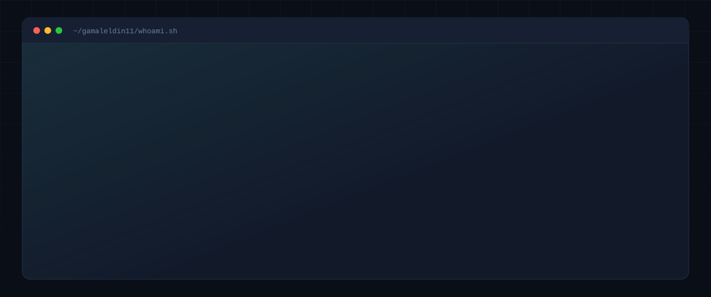

<picture>
  <source media="(max-width: 600px) and (prefers-color-scheme: dark)" srcset="assets/banner-mobile-dark.svg">
  <source media="(max-width: 600px) and (prefers-color-scheme: light)" srcset="assets/banner-mobile-light.svg">
  <source media="(prefers-color-scheme: dark)" srcset="assets/banner-dark.svg">
  <source media="(prefers-color-scheme: light)" srcset="assets/banner-light.svg">
  
</picture>

  

<!-- Once the portfolio is live on Vercel, uncomment this and put the real URL
     in the href. A badge pointing at a dead link is worse than one badge fewer,
     which is why it ships commented out rather than pointing at a guess.

-->

 

<picture>
  <source media="(prefers-color-scheme: dark)" srcset="https://readme-typing-svg.demolab.com?font=JetBrains+Mono&weight=500&size=20&duration=2800&pause=1200&color=5EEAD4&background=0A0E17&center=true&vCenter=true&width=700&height=50&lines=Full-Stack+.NET+Engineer;Building+FinSight,+an+AI+CFO+for+small+businesses;ASP.NET+Core+%2B+Angular+%2B+LLM+orchestration;Author+of+an+8-track+interview+handbook;Open+to+opportunities">
  <source media="(prefers-color-scheme: light)" srcset="https://readme-typing-svg.demolab.com?font=JetBrains+Mono&weight=500&size=20&duration=2800&pause=1200&color=0D9488&background=F7F9FC&center=true&vCenter=true&width=700&height=50&lines=Full-Stack+.NET+Engineer;Building+FinSight,+an+AI+CFO+for+small+businesses;ASP.NET+Core+%2B+Angular+%2B+LLM+orchestration;Author+of+an+8-track+interview+handbook;Open+to+opportunities">
  
</picture>

---

##  Hello

I'm a software engineer working across the full **.NET** stack — C#, ASP.NET Core,
Entity Framework Core and SQL Server on the back end, Angular and TypeScript on
the front.

What actually interests me is the seam where those systems meet machine learning:
forecasting engines, LLM orchestration, and models that have to survive contact
with real users rather than stay in a notebook. (Degrees and certifications are
under [Background](#-background) below.)

Right now I'm a **Tech Specialist intern at Beeviro**, building web applications
for the agency's clients, after finishing the ITI intensive .NET track.

---

##  What I'm building

> ### FinSight — an AI virtual CFO for small businesses
>
> Most small companies have no financial analyst, so the software has to do the
> analyst's job: notice the problem, quantify it, and say what to do about it.
> FinSight ingests a company's transactions, forecasts 90 days of cash flow,
> detects risk before it becomes a crisis, and explains what it found in plain
> language.

| Source files | Commits | Engineers | DB tables |
|:---:|:---:|:---:|:---:|
| **464** | **115** | **6** | **30** |

**What that involved**

- 17 controllers with command/query-separated DTOs, a generic repository over
  Unit of Work, and multi-tenancy through a scoped tenant service
- JWT bearer auth with an HTTP-only cookie fallback, full issuer/audience/lifetime
  validation, and role-based authorisation over ASP.NET Identity
- **Nixtla TimeGPT** for time-series cash-flow forecasting and **LangFlow**
  for the recommendation and chat layer, orchestrated through LangFlow
- Real-time alerting on **SignalR**, with **Hangfire** running scheduled forecast
  jobs behind an admin-only dashboard
- A 30-table SQL Server schema with code-first migrations and a daily aggregation
  layer for the hot query path
- Health-check endpoints, a global exception handler, environment-aware config,
  and both unit and integration test projects

[**→ Source**](https://github.com/gamaleldin11/FinSight_G)

 

> ### Career Tracks Handbook — eight interview courses in one site
>
> A written course for every role I interview for: frontend, backend, full-stack,
> data analyst, data scientist, data engineer, AI engineer and network &
> connectivity engineer. Every track ends in a system-design stage and a self-test
> whose wrong answers link back to the section to reread.

| Modules | Tracks | Sections | Self-test questions |
|:---:|:---:|:---:|:---:|
| **116** | **8** | **1,491** | **444** |

**What that involved**

- A Node build that turns Markdown modules into one searchable page with a
  per-track sidebar, an Entry / Mid / Senior level filter, a site-wide glossary,
  progress tracking and dark and light themes
- Importers that pull two existing courses (an Obsidian handbook and a hand-written
  HTML bootcamp) into the same site without rewriting them, with maths rendered at
  build time through KaTeX
- A shared system-design series, from the request path and scaling a product
  step by step to reliability patterns and design questions for each role
- Fast-moving facts checked against primary sources, with sources at the end of
  every module
- A strict build that fails on any broken cross-reference, checked in GitHub
  Actions on every push and deployed on Vercel

[**→ Live site**](https://career-tracks-amber.vercel.app/) &nbsp;·&nbsp; [**→ Source**](https://github.com/gamaleldin11/career-tracks)

---

##  Selected work

<b>Speech Emotion Recognition</b> — transformer-based emotion classification from raw audio &nbsp;·&nbsp; <code>93% accuracy</code>

 

My **graduation project**, graded **4.0 / Excellent**. It classifies emotion from
the acoustic properties of speech rather than from what is said, so it never needs
a transcript.

- Fine-tuned a pretrained **HuBERT** encoder from Hugging Face — linear projection
  to 256 dimensions, dropout regularisation, classification head over the pooled
  temporal representation
- Made the encoder swappable: moving to Wav2Vec2 is a single config change, since
  models load through the `AutoModel` abstraction
- Trained on the **ShEMO** corpus (~3,000 semi-natural utterances, 3h25m of speech)
  with augmentation to counter significant class imbalance
- Shipped as a working desktop application — login, patient records, live
  microphone capture, SQLite persistence — not a notebook
- **93% accuracy**, validated with a confusion matrix across the emotion classes

<b>Online Course Store</b> — a teacher's own course shop with Egyptian payment methods

 

An online shop where an independent teacher sells their own courses, so they keep
what they earn instead of paying a marketplace a share of every sale.

- Customers browse, buy and start a course on any device
- **Stripe, Paymob and Fawry** behind one payment interface, so Egyptian customers
  can pay by card or in cash at a kiosk
- Verified payment callbacks, so a course unlocks only once the money has
  actually arrived

<b>Fractional Investment Platform</b> — Angular SPA for fractional ownership of high-value assets

 

Breaks property, gold and equities into affordable fractional shares, so a user
can build a diversified position without the capital a whole unit would need.
Covers the full journey from landing page to funded, tracked holdings. Built with
a team of five.

- 17 components and 11 routed pages — dashboard, listings, asset detail, checkout,
  deposit funds, authentication
- Route guards for admin access and user-existence checks, plus six injectable
  services covering auth, API access, payments, notifications and projects
- PayPal checkout flow and a built-in chatbot assistant with typing indicators
  and message threading

<b>Enterprise MVC & Identity Suite</b> — ASP.NET Core MVC with full authentication workflows

 

A pair of applications built to work through the parts of enterprise .NET that
matter in production.

- Full CRUD over a student/department domain via a repository abstraction with
  interfaces, rather than `DbContext` straight from controllers
- Schema evolution through EF Core code-first migrations, including an auth
  migration layered onto an existing schema
- Registration and login on ASP.NET Identity with view models and server-side
  validation, plus a second application demonstrating external OAuth login

<b>FinSight Presentation Engine</b> — an animated slide deck as a web application

 

Rather than exporting slides, I built the presentation as an application:
full-screen animated transitions, keyboard-driven navigation, and a live editor
so content can be corrected mid-presentation without leaving the deck.

Arrows and space to navigate, `E` to edit in place, `R` to replay animations,
`F` for fullscreen. Slide definitions are separated from editable content, so
copy changes never touch layout code.

---

##  Stack

Hover an icon for its name.

**Backend**
&nbsp;

**Frontend**
&nbsp;

**Data**
&nbsp;

**AI / ML**
&nbsp;

**Systems & tooling**
&nbsp;

---

##  Background

| | | |
|:--:|:--|:--|
|  | **Tech Specialist Intern** | Beeviro, Egypt — Aug 2026 to now |
|  | **Software Development Trainee** | ITI intensive .NET track — Jan to Jul 2026 |
|  | **Implementation Engineer** | Bishara, Kuwait — supporting Farwaniya Hospital's system, 2025 |
|  | **BSc (Hons) Computer Systems Engineering** | University of Greenwich — Second Class Honours, First Division |
|  | **BSc Computer Systems Engineering** | MSA University — GPA 3.11, graduation project graded 4.0 |
|  | **Data Science and Machine Learning** | CLS Learning Solutions — Nov 2025 to Jan 2026 |
|  | **Digitera Technical Track** | ICareer — Sep 2026 |
|  | **Networking & Cybersecurity** | SYSTEL Telecom × Digital Hub — 72 credit hours |
|  | **HCIA-AI** | Huawei × ICT Talent Bank |

Outside the CV: six years volunteering with **Resala Charity Organization**,
teaching English and running IT-literacy classes for people who had never touched
a computer. Arabic native, English fluent.

---

##  Activity

<picture>
  <source media="(prefers-color-scheme: dark)" srcset="https://github-readme-stats.vercel.app/api?username=gamaleldin11&show_icons=true&hide_border=true&bg_color=0A0E17&title_color=5EEAD4&icon_color=5EEAD4&text_color=9DB0CF&border_color=22304A">
  <source media="(prefers-color-scheme: light)" srcset="https://github-readme-stats.vercel.app/api?username=gamaleldin11&show_icons=true&hide_border=true&bg_color=F7F9FC&title_color=0D9488&icon_color=0D9488&text_color=4A5B73&border_color=D7E0EC">
  
</picture>
<picture>
  <source media="(prefers-color-scheme: dark)" srcset="https://github-readme-stats.vercel.app/api/top-langs/?username=gamaleldin11&layout=compact&hide_border=true&bg_color=0A0E17&title_color=5EEAD4&text_color=9DB0CF&border_color=22304A">
  <source media="(prefers-color-scheme: light)" srcset="https://github-readme-stats.vercel.app/api/top-langs/?username=gamaleldin11&layout=compact&hide_border=true&bg_color=F7F9FC&title_color=0D9488&text_color=4A5B73&border_color=D7E0EC">
  
</picture>

<picture>
  <source media="(prefers-color-scheme: dark)" srcset="https://streak-stats.demolab.com/?user=gamaleldin11&hide_border=true&background=0A0E17&stroke=22304A&ring=5EEAD4&fire=5EEAD4&currStreakNum=E8EEFB&sideNums=E8EEFB&currStreakLabel=5EEAD4&sideLabels=9DB0CF&dates=5C6B82">
  <source media="(prefers-color-scheme: light)" srcset="https://streak-stats.demolab.com/?user=gamaleldin11&hide_border=true&background=F7F9FC&stroke=D7E0EC&ring=0D9488&fire=0D9488&currStreakNum=101828&sideNums=101828&currStreakLabel=0D9488&sideLabels=4A5B73&dates=77879E">
  
</picture>

<!-- Regenerated daily by .github/workflows/snake.yml onto the `output`
     branch — see that workflow for how the snake and its theming are
     produced. The two images below 404 until that workflow has run once. -->
<picture>
  <source media="(prefers-color-scheme: dark)" srcset="https://raw.githubusercontent.com/gamaleldin11/gamaleldin11/output/snake-dark.svg">
  <source media="(prefers-color-scheme: light)" srcset="https://raw.githubusercontent.com/gamaleldin11/gamaleldin11/output/snake.svg">
  
</picture>

---

###  Let's build something

The fastest way to reach me is email.

Cairo, Egypt &nbsp;·&nbsp; open to full-stack and .NET engineering roles

